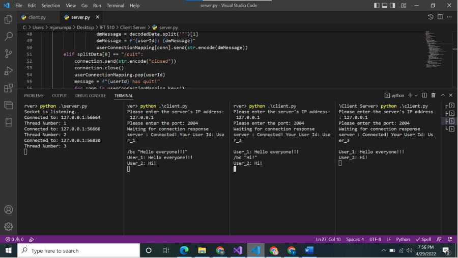

# Chat-Server

The chat server mainly has two components.

### **1. Server:**

This accepts the connection requests from all the clients. After the connection is successful, the server acts as a gateway for communication between the clients. Client sends a command to the server and the server processes the command immediately after receiving it. For every client, the server starts a thread and connection request from each client is accepted and processed inside the thread. With this multi-threading, the server will be able to respond to the requests of other clients even while processing the current request.

### **2. Client**

The client initiates the connection request with the server and sends the required commands to the server to communicate with other clients. The client receives the responses from the server in a thread and listens to the user input in another thread.


The server runs on a machine and is bound to a specific port. The client sends the initial request with the server’s IP address and port to the server. Once the server receives this request, the server accepts and assigns a unique name to the client. The server assigns the name ‘User_1’ to the first client and assigns the next name according to the client’s request. Both the server and the client listen continuously once the connection is established. Multiple clients can send an initiation request to the server at the same time with the server’s IP address and port. The server accepts all the requests and establishes a communication channel with every client. The server can accept subsequent requests from the clients as well.

## **List of Commands:**

### **1. Users Command**

This command lists all the usernames of the clients that are connected to the server when the request was sent. The server sends this list to the client that requested it.

    ```
    /users
    ```


### **2. DM Command**

A client sends this command to send a message to the user specified in the command. The server receives this command from the client and sends the message to the corresponding user.

    ``
    /dm User_2 “Hello there!”
    ```


### **3. BC Command**

A client sends this command to the server to broadcast the message to all the connected users. The server receives this command and sends the message to the rest of the clients.

    ```
    /bc “Hello everyone!!!”
    ```


### **4. Help Command**

When the client enters this command, a list of valid commands is displayed to the client. The client can refer to the commands for help.

    ```
    /help
    ```


5. Quit Command

When the client enters this command, this request is sent to the server. The server then disconnects the client and notifies the remaining clients that corresponding client has left the chat.

    ```
    /quit
    ```

